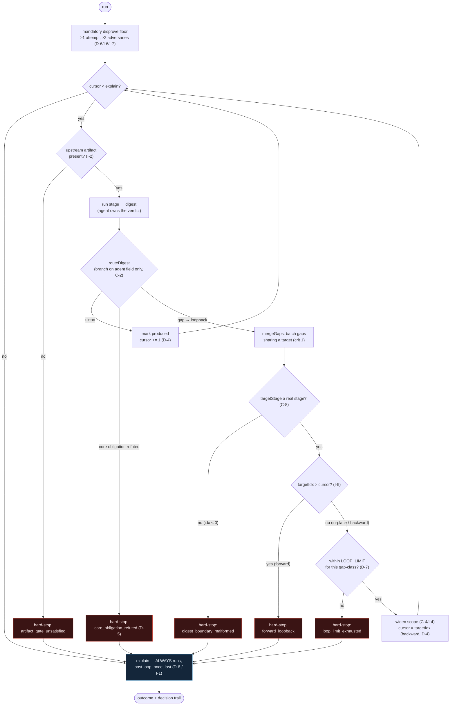

# Sagittarius

**The orbital-shifting reasoning pipeline, realized as one deterministic, background-runnable Workflow — and formally verified against its own design.**

Sagittarius takes the seven-stage [orbital-shifting](https://github.com/theTyster/orbital) pipeline (close-world → decompose → model-obligations → prove-invariants → instantiate → realize → measure, plus an always-runs `explain` closer) and moves its orchestration out of a "smart" Opus skill and into a plain, deterministic **Workflow script**. The payoff: parallelism on the provable/testable stages, a hard token budget, journal-resume, and — uniquely — a control flow that **can itself be formally verified**.

It is named after **Sagittarius A\***: the [Event Horizon Telescope](https://eventhorizontelescope.org/) imaged it by having independent, isolated teams reduce the data separately and only then converge — a bias defense by structural independence. That is exactly orbital's thesis (independent specialists, role-briefed with minimal context, converging through an adversarial floor), so the workflow that embodies it carries the name.

## Status

| | |
|---|---|
| Formal gate (Lean) | ✅ **7/7 invariants proven non-vacuous + adversary-survive** over a non-degenerate model (kimmy gate satisfied) |
| Prolog ↔ Lean | ✅ **F-11 reconciled** — the model + both dumps match the rebuilt Lean (the inaugural commit of this repo) |
| Behavioral tests | ✅ **24/24** proof-property + **8/8** C-2 regression-guard (self-spec) + **7/7** F-13 digest-boundary guard + **12/12** recon (`tests/`), all green |
| Maturity | **Experiment.** kimmy gate satisfied; **first real-ticket run done** (#2701) — surfaced **F-12** (a refinement-gap livelock, *not* an Orbital Inversion). **Bundle A guards (C-8 / I-9) since landed (F-13).** Not promoted to the canonical pipeline (D-13). |

See [`thoughts/FINDINGS.md`](thoughts/FINDINGS.md) (F-1…F-13) for the full audit trail — the three defects the dogfood's own gates caught and fixed, the pre-kimmy re-statement, the F-11 Prolog↔Lean reconciliation, F-12 from the first real-ticket run, and **F-13 (Bundle A: the C-8 / I-9 digest-boundary guards, landed + lock-tested)**. Bundle A kills F-12's phantom-stage and forward-loopback mechanisms; the **dominant** livelock (a re-spelled-`gapClass` re-mint) still awaits the finite-domain budget re-key — the **I-3-premise** repair (B1) + its Lean re-statement (B2).

## The line it holds

There is one rule the whole design exists to protect: **the substrate does the bookkeeping (sequencing, counting budgets, routing requests) but never makes a judgment call.** "Is this proven / refuted / inconsistent?" stays with the AI agents; the Workflow may only *read* a verdict an agent already emitted and act on it. The design calls this **separation of authority** (D-2); the forbidden failure is the **inversion smell** (C-2). A prior self-orchestration framing was refuted; structural-layer-separation is the framing that survived.

## Control flow

The loop below is the whole of `sagittarius.workflow.js`. The substrate walks a **movable cursor** (D-4) forward through the seven interior stages, branching **only** on the agent-emitted digest (C-2): a clean digest *advances*, a routed gap *loops back*, a refuted core obligation *hard-stops*. Every path — happy or halted — falls through to `explain`, which **always runs exactly once, last** (D-8 / I-1). The loopback edge is the one place the cursor moves backward, and it is fenced by the digest-boundary guards (C-8 / I-9, F-13) and the per-gap-class `LOOP_LIMIT` (D-7 / I-3) so the run is guaranteed to terminate.



> **How to read it.** Red nodes are the terminate-and-report **hard-stops** — one agent-emitted (`core_obligation_refuted`) and four substrate-mechanical (the artifact gate, the two F-13 digest-boundary guards, and the loop-limit). The blue `explain` node is the sink every arrow eventually reaches. Note the guards sit **before** the cursor moves backward: the substrate refuses to step outside its proven `Step` relation rather than honor malformed control data (the F-12 lesson).

## Repo map

```
sagittarius.workflow.js        the deterministic orchestration loop (branches only on agent digests)
realized/                      sagittarius.realized.mjs — the Workflow-tool port (specialists called directly)
lib/                           ten pure, separately-tested mechanics:
                                 stage-order, scope-set, termination-measure, loop-limit,
                                 gap-batching, disprove-reserve, digest-router, digest-fold, decision-trail,
                                 + recon-plan (I-8 recon/primer seed — spec'd & unit-tested, not yet wired in)
schemas/                       stage-digest.schema.js — the control-plane data shape (D-3)
self-spec/                     the dogfood artifact chain (the pipeline run on THIS repo's own design):
                                 existing-world.pl  hypothesis.pl  target-world.pl  model_results.pl
                                 lean/Proofs/*.lean  lean_proof_results.pl  lean_disproofs/*.lean
                                 tests/*.js  adherence_*.{pl,md}  explanation.md
tests/                         recon_plan.test.js — unit test for the recon mechanic; and
                                 digest_boundary_guards.test.js — F-13 lock-test for the C-8 / I-9
                                 guards (kept out of self-spec/tests/ so the 24+8 headline stays intact)
.claude/agents/                recon.md — the recon agent (resolves the per-artifact path map + window)
docs/                          design-spec.md, architecture.md, decisions.md, glossary.md, index.md
thoughts/                      tracked working area (NOT a gate): FINDINGS.md, HANDOFF.md, the discovery
                                 deck/, the recon-upgrade/ experiment, in-progress recon dogfood artifacts
                                 — see thoughts/README.md
```

> **Path note — two different `thoughts/`.** This repo now tracks a [`thoughts/`](thoughts/) working area (notes, the deck, the recon-upgrade experiment, WIP). Separately, the **historical** docs — `thoughts/FINDINGS.md`, `thoughts/HANDOFF.md`, `docs/design-spec.md`, and everything under `self-spec/` — were authored when this code lived at `orbital/experiments/pipeline-workflow/`. Where they cite `thoughts/X` read **`self-spec/X`** (their `thoughts/` is what became `self-spec/`, *not* this repo's `thoughts/` directory); where they cite `experiments/pipeline-workflow/X` read `X` (repo root); the design spec they cite is [`docs/design-spec.md`](docs/design-spec.md). See [`docs/index.md`](docs/index.md).

## Verify it

**Prolog (model + dumps) — fast, no build:**

```bash
swipl -q -g "consult('self-spec/target-world.pl'), \
  aggregate_all(count, verdict(_,consistent), N), format('~w/7 consistent~n',[N]), halt"
# expect: 7/7 consistent  (also: 11 cf_facts / 11 cf_status / 11 contradicts / 2 absent)
```

**Behavioral tests (Node ≥ 18):**

```bash
node --test self-spec/tests/*.test.js
# 24 proof-property tests + 8 C-2 regression-guard tests, all green
# (Pass the glob, not the bare directory: `node --test self-spec/tests/` is
#  treated as a module path and errors on recent Node — observed on v26.)

node --test tests/*.test.js
# 12 recon-plan (I-8) + 7 F-13 digest-boundary guard (C-8 / I-9) tests, all green.
# Kept out of self-spec/tests/ so the 24+8 headline above stays intact.
```

**Lean proofs:** the proofs are recorded in `self-spec/lean_proof_results.pl` and were machine-checked axiom-free during the re-statement (full `lake build` = 8259 jobs, exit 0). Re-checking requires a Lean 4 toolchain + a (prebuilt) Mathlib — see [`docs/index.md`](docs/index.md). The toolchain config travels with the repo (`self-spec/lean/{lakefile.lean,lean-toolchain,lake-manifest.json}`).

## Prerequisites

- **SWI-Prolog** (`swipl`) — for the model and dumps.
- **Node ≥ 18** — for the behavioral test suite.
- **Lean 4** (via [elan](https://github.com/leanprover/elan)) + a Mathlib clone — only to re-check the proofs from source.

## Provenance

Split out of [`orbital`](https://github.com/theTyster/orbital) (`experiments/pipeline-workflow/`) on 2026-06-01 with `git filter-repo`, preserving the full 10-commit history (re-rooted to the repo top). The first native commit is the **F-11** Prolog↔Lean reconciliation.

## Documentation

- [`docs/design-spec.md`](docs/design-spec.md) — the canonical decisions/constraints/invariants the dogfood verified (the pipeline's input).
- [`docs/architecture.md`](docs/architecture.md) — how the deterministic Workflow is built and why.
- [`docs/decisions.md`](docs/decisions.md) — the decision log (D-1…D-13, C-1…C-6, I-1…I-7, R's) with current status.
- [`docs/glossary.md`](docs/glossary.md) — sagittarius, kimmy, CWA, Pattern 3, the inversion smell, and the rest of the vocabulary.
- [`self-spec/explanation.md`](self-spec/explanation.md) — a plain-language, non-technical account of a full run (read this first if you don't read Lean/Prolog).

## License

Apache 2.0 (see [`LICENSE`](LICENSE) if present; inherits orbital's license otherwise).
